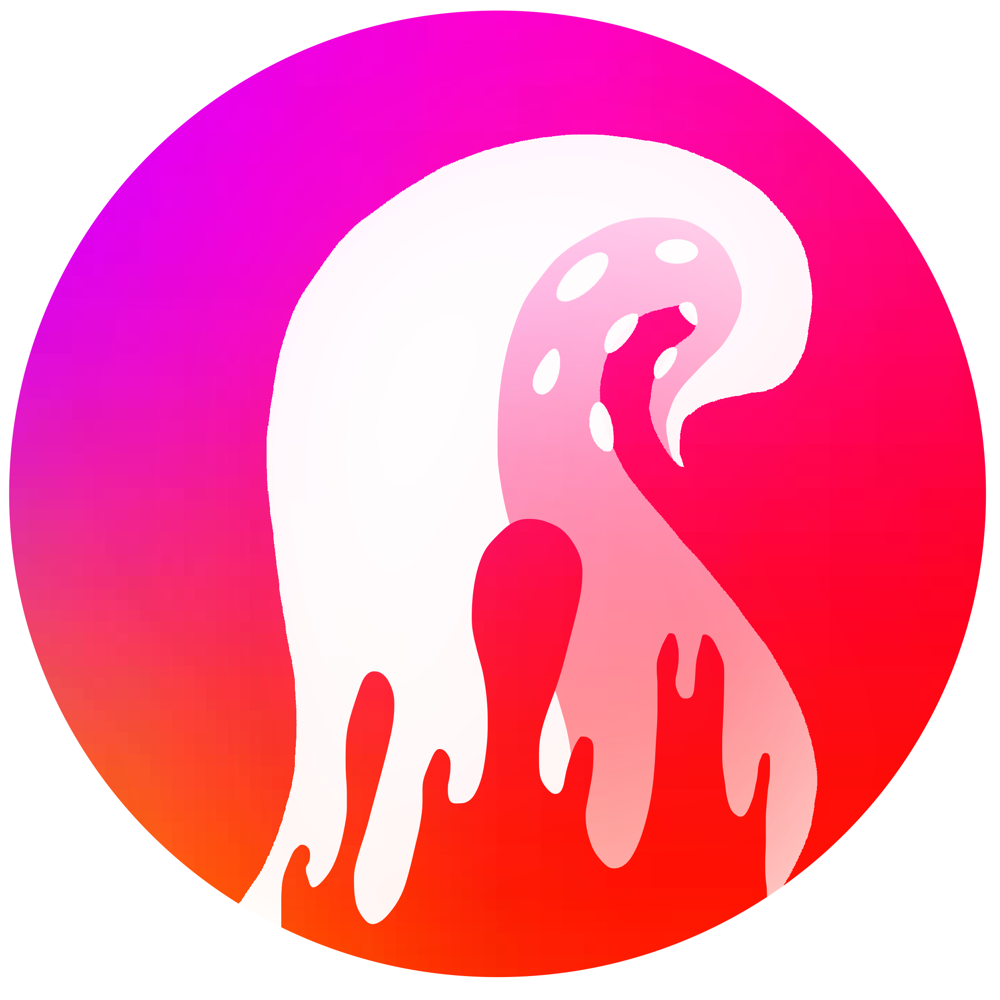
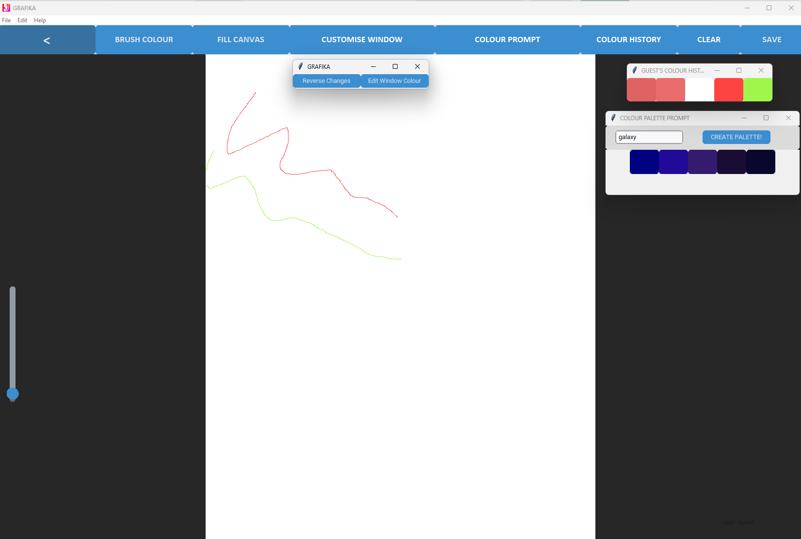

<p align="center">
  
</p>

# GRAFIKA

GRAFIKA is a desktop drawing application I built in Python for my A-Level Computer Science NEA.

The project was inspired by my own interest in art. I had already spent years drawing and creating commissioned artwork using software such as Clip Studio Paint and Procreate, so I wanted to build a graphics application of my own rather than choose a completely unrelated NEA idea.

## Preview


## Features

* User sign-up, login and guest access
* Custom canvas sizes
* Brush colour and brush size controls
* Fill and clear canvas tools
* Colour history
* Prompt-based colour suggestions
* Light and dark appearance options
* Save artwork as an image
* SQLite database for user accounts

## Built With

* Python
* CustomTkinter
* Tkinter
* SQLite
* JSON
* Pillow

## Running the Project

Clone the repository:

```bash
git clone https://github.com/dvanlaarhoven/grafika.git
cd grafika
```

Install the required packages:

```bash
pip install -r requirements.txt
```

Run the application:

```bash
python main.py
```

## Project Structure

```text
grafika/
├── GrafikaPictures/
├── Miscellaneous/
├── utility/
├── colourData.json
├── main.py
├── requirements.txt
└── README.md
```

## About the Project

GRAFIKA was one of my first larger Python projects and gave me a way to combine programming with something I was already interested in outside of Computer Science.

As I already used drawing software for my own artwork and commissions, I focused on features that felt familiar to me, including brush controls, colour selection, canvas settings and saving artwork.

I also used the project to experiment with areas I had less experience with at the time, including:

* building a desktop interface with CustomTkinter
* storing user account data with SQLite
* saving and retrieving colour history
* using JSON data for colour suggestions
* handling different drawing and canvas controls

I also created a prompt-based colour suggestion feature, where a user can enter a short prompt and the program checks for predefined keywords stored in JSON before displaying a relevant colour palette. As the system is based on hard-coded keyword mappings, it cannot currently interpret words or concepts outside the predefined dataset.

The project is kept fairly close to the original version I submitted. Looking back at it now, there are parts of the code and project structure that I would approach differently, but I wanted the repository to reflect how I originally developed it.

## Possible Improvements

If I returned to GRAFIKA, I would look at:

* improving file and database handling
* adding automated tests
* replacing the hard-coded keyword mapping with a more flexible recommendation approach that can handle unseen words and broader prompts
* improving consistency across the interface
* allowing users to reopen and continue editing saved artwork

## Author

**Dmarion Asante Van Laarhoven**

GitHub: [dvanlaarhoven](https://github.com/dvanlaarhoven)
